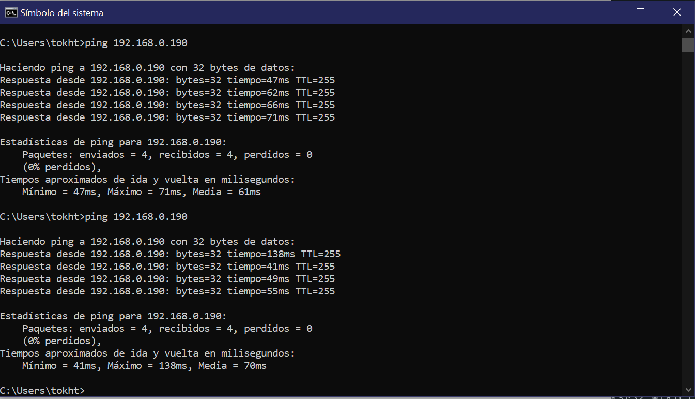
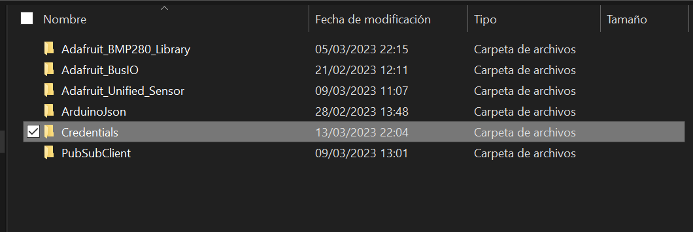

### Json Parser y SPIFFS

     
     

Prueba del sistema de archivos SPIFFS.

*¿Para qué queremos un sistema de archivos como SPIFFS? Da un ejemplo de uso.* 
Este sistema de archivos es útil dentro del contexto del esp32 ya que por sus capacidades de conectarser a la web podemos almacenar archivos en la memoria flash que, por ejemplo puedan levantar un pequeño servidor, si es que le cargamos algún archivo html, o para guardar información sensible que sólo deba ser leída por la tarjeta esp32 sin exponer esta información deliberadamente para que funcione bien nuestro programa. 

     

Extensión "ESP32 Sketch Data upload"

*¿Por qué no podemos instalar Sketch Data Upload en Arduino IDE V2?*
Creo que sólo porque el plugin no ha sido actualizado para funcionar con esta nueva versión

     

Formato json

 Y se adjunta el programa **[json_serializer](https://github.com/hectorpsfc/Mc_dig/blob/main/S5/json_serializer/json_serializer.ino)** que serializa las lecturas de los sensores en formato json, y también se imprimen en el monitor serie.

### Módulo RF

      

Gif que muestra la conexión entre el monitor serial y la terminal del celular.

     

Captura que muestra el envío por serial bluetooth con las mediciones que realiza el sensor.

     

Captura que muestra la conexión al WiFi local y la IP de la ESP32.

     

Prueba de PING.

     

Captura a la librería Credentials.h.

*¿Podemos usar simultáneamente WiFi y Bluetooth con ESP32?*
No de forma simultánea, porque sólo tenemos un módulo que funciona con la banda 2.4Ghz, Bluetooth y wifi funcionan en esta banda, por lo que sólo se puede usa una función a la vez, sin embargo existe el programa de ejemplo wifibluetooth switch, que nos puede ayudar a tener lo más parecido a una conexión simultánea intercambiando las funciones.

*¿Por qué creamos Credentials.h?*
Crear esta librería, es la forma segura de no arriesgar nuestra información sensible (como la ssid y contraseñas), con esto se evita el tener que hardcodear tus credenciales pero que funcione cuando lo necesites, es por seguridad. 

A continuación se incluyen los programas **[Bluetooth_logger](https://github.com/hectorpsfc/Mc_dig/blob/main/S5/Bluetooth_logger/Bluetooth_logger.ino)** y 
**[Conexion_WiFi](https://github.com/hectorpsfc/Mc_dig/blob/main/S5/Conexion_WiFi/Conexion_WiFi.ino)**

