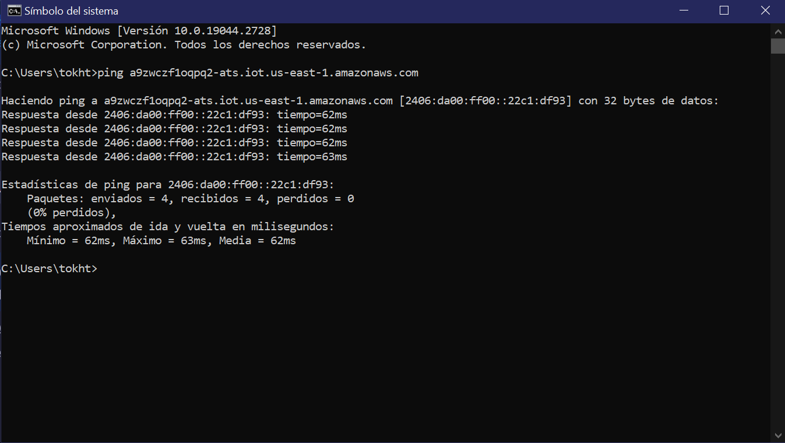
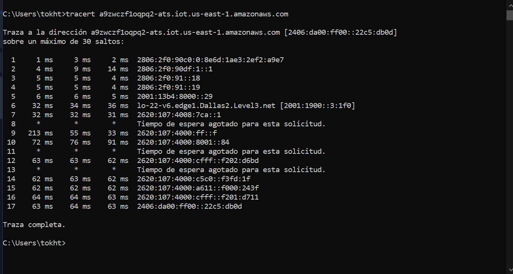
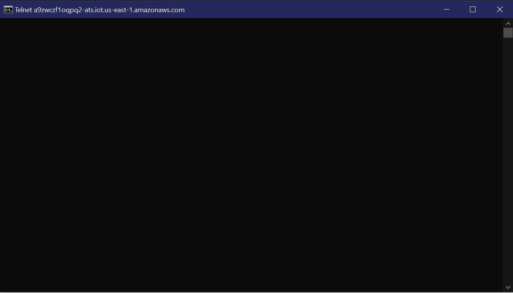
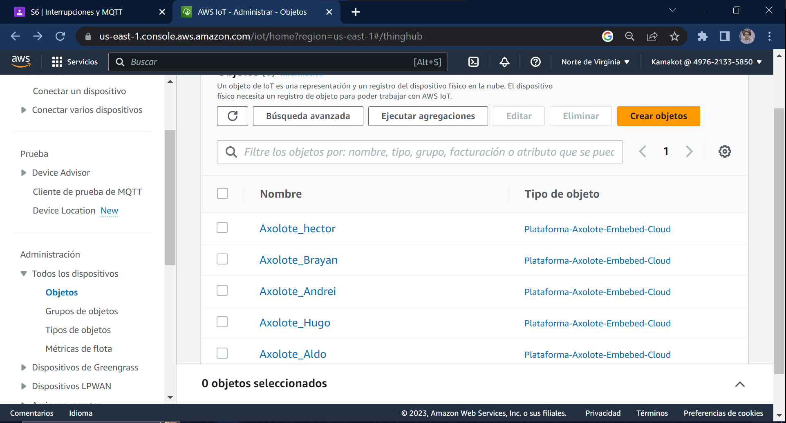
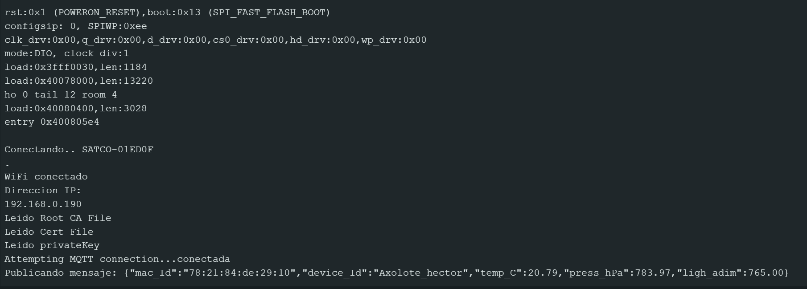
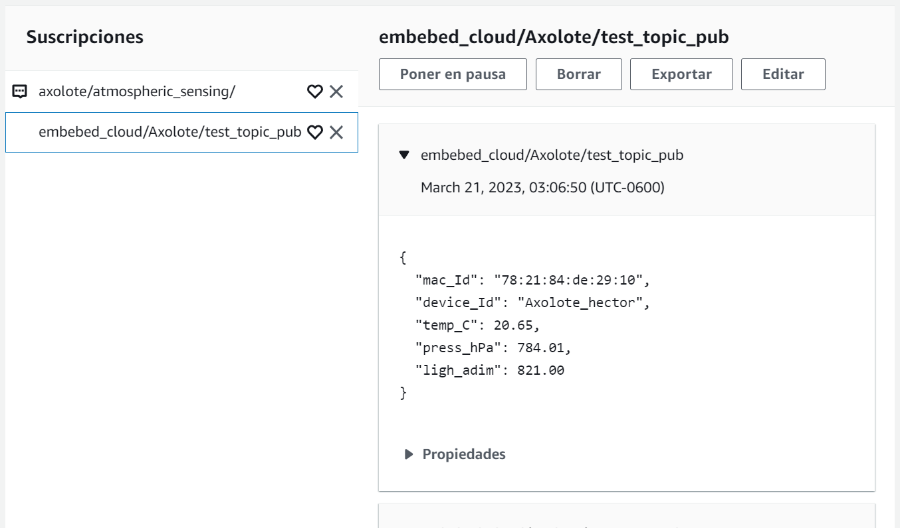

### Interrupciones

En **[este](https://drive.google.com/file/d/1i6sH_AhTA1FDEi_R4kMz9AF63hAowYHH/view?usp=sharing)** enlace, podemos ver un video que muestra al programa **[intButton](https://github.com/hectorpsfc/Mc_dig/blob/main/S5/json_serializer/json_serializer.ino)**(no está el programa por el mensaje de classroom) en uso, contando la cantidad de veces que se presiona el botón.

## *1*
La ventaja de la interupción es que nos permite tener un mejor control y conocimiento de que es lo que pasa en todo momento con nuestro setup, pues cuando usamos polling, podemos perdernos de información que haya sido introducida en nuestro sistema por problemas de retraso en la lectura de la señal, mientras que si usamos una interupción adecuada, podemos tener total control y conocimiento sobre estos eventos, ya que el programa original simplemente es interrumpido para atender cualquier entrada de datos que sea detectada. 

## *Bouncing*

El bouncing se refiere a las fluctuaciones que llega a sufrir una pieza de hardware por el simple hecho de cambiar de estado (posición, presionar y soltar un botón, etc.), este se debe a la misma naturaleza de la construcción del hardware, el problema dentro de nuestro conexto, es que estas pequeñas fluctuaciones puede llegar a activar nuestra función de interrupción de manera errónea, para mitigar este pequeño error, podemos mediante software crear una ventana de tiempo, que nos permita saltarnos este pequeño intervalo y poder evitar leer estas fluctuaciones de forma errónea.

Mediante hardware, una de las soluciones es incluir un condensador en paralelo con el botón, para poder estabilizar la señal, o hacer la curva más suave y de un sólo sentido para que no se lea como una fluctuación. 

### MQTT

# *ping*
El ping nos sirve para checar el tiempo de retraso en la conexión con el servidor  al cual nos estamos conectando, podemos ver la dirección ip final.

     

# *tracert*
Podemos ver los servidores y routers intermediaros entre nuestra computadora y el servidor con el que nos estamos conectando, mostrándonos el tiempo que tarda en conectarse.

     

# *telnet*
Nos permite la comunicación directa con el servidor del otro lado, mandando un mensaje no cifrado, por lo que cualquier persona podría ver este mensaje si lo intercepta. 

     

Captura que muestra el objeto "Axolote_hector"

     

Captura lmonitor serial enviando información al cliente MQTT

     

Captura al cliente de prueba ioT core que lee los mensajes que llegan al servidor

     

En este otro **[video](https://drive.google.com/file/d/1xWNjkXX5A0TyamTsngioFQmjXmGZEqpa/view?usp=sharing)**, podemos ver un video que muestra que el monitor serie despliega el mensaje que mandamos desde el cliente de prueba al tópico al que está suscrito el ESP32

(Aún no hago push del mqtt, espero aprobación)