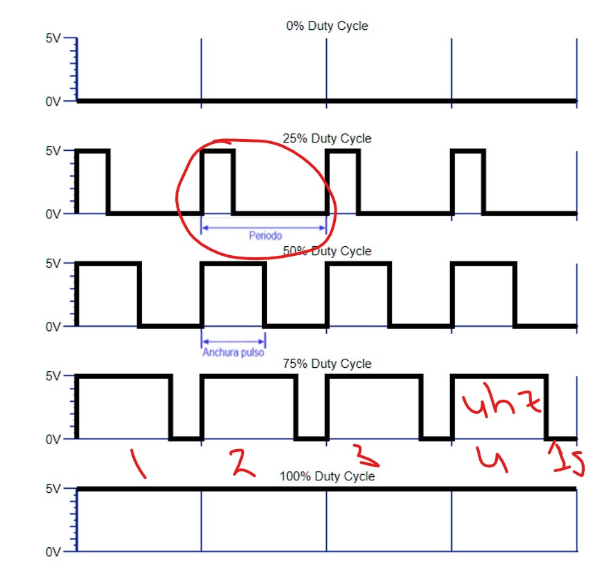
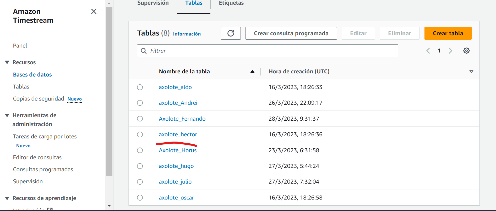
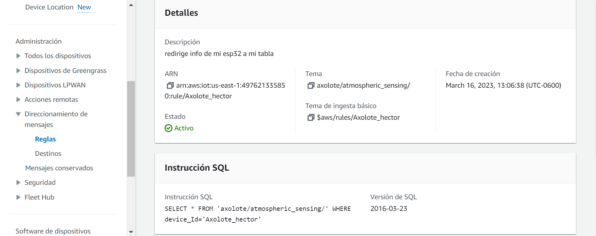
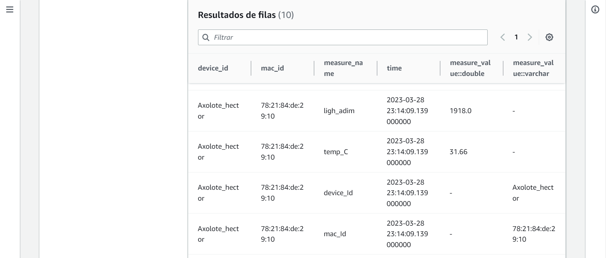
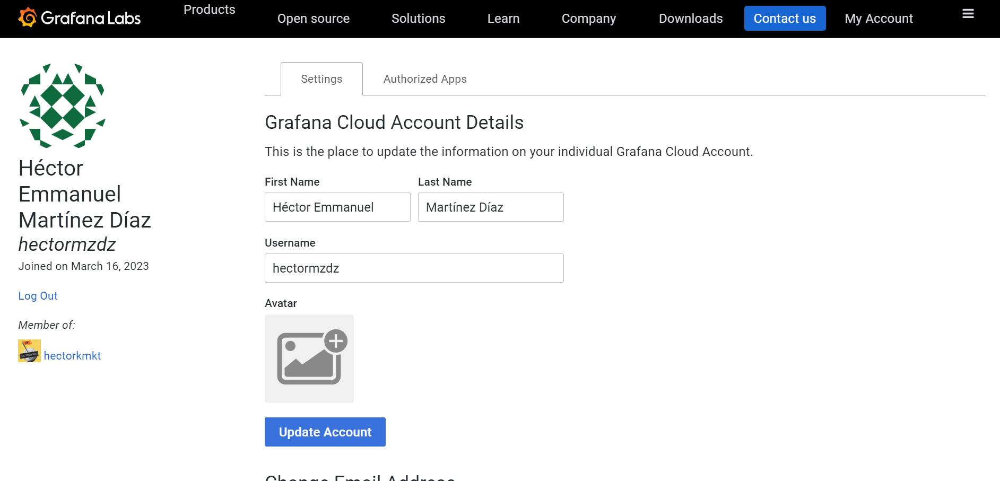

### PWM y TimeStream

*1.*
En el siguiente **[enlace](https://drive.google.com/file/d/1dwTU-U_J4qvlogpgSXRI7mWMtelmXQdH/view?usp=sharing)**, podemos ver un video que muestra como controlamos el brillo del led con el potenciómetro.

*2.*
En **[este](https://drive.google.com/file/d/1KRjeRqG6hm_3dXdPUhFfQpk2yPLPiwDi/view?usp=sharing)**, otro podemos ver un video que muestra como el brillo se controla con el LDR.

*3.*
Porque en nuestro sistema no tenemos una forma de hacer variar el voltaje de forma analógica(a como estáconectado, pues tenemos salidas DAC), sólo podemos proporcionar una salida digital (es decir, encendido o apagado), en nuestro caso queremos una salida de tensión de forma analógica y una forma de simularlo es emitiendo estas señales PWM, donde el voltaje es el promedio de salida PWM.

*4.*
EL ciclo de trabajo corresponde a la duración en porcentaje, del tiempo de encendido en el dispositivo en un periodo al emitir una señal PWM, la frecuencia es el número de periodos por unidad de tiempo(segundo),

     

*5.*
Analogwrite no hace la operación inversa porque está diseñada justo para emitir señales PWM, si queremos usar una función inversa al analogread() tendrá que ser *dacwrite()* ya que esta está basada en que se ocupen los gpios que tengan función DAC en nuestra esp32 que sólo son el 25 y 26.

*6.*
Para Arduino IDE la frecuencia de *analogWrite()* por default es de 490hz, dependiendo del dispositivo y pins al que lo estés conectando, pero según la documentación delesp32, si hay funciones con las que puedes controlar la frecuecnia y resolución de los ciclos de trabajo. 

*7.* se anexa el programa **[led_pwm](https://github.com/hectorpsfc/Mc_dig/blob/main/S7/led_pwm/led_pwm.ino)**

### Timestream

*1.*

     

*2.*

     

*3.*
Select se refiere a justo la información q1ue queremos poner en la base de datos, para este caso, es todo, para el from, es el tópico del que queremos jalar la información, en este caso es del tópico *axolote/atmospheric_sensing* y  el Where, es para seleccionar un atributo en específico de donde se va a obtener la información.

Entonces en nuestro caso, agarra toda la información del tópico elegido donde el *device_Id = 'Axolote_hector'* o sea es la información que yo introduje, al tópico principal.

*4.*
El rol nos permite controlar que usuarios de la organización tienen los permisos para realizar algunas tareas o acceder a recursos en Amazon

*5.*

     

*6.*
Timestream es una base de datos de serie temporal que nos permite guardar información, dependiendo de donde la necesitemos, se puede usar para analizar la infromación con herramientas qe el mismo amazon provee, o con herramientas como grafana, te permite almacenar en memoría fría(discos hdd) datos más antiguos y conservar los más recientes disponibles de forma rápida. 

*7.*

     

